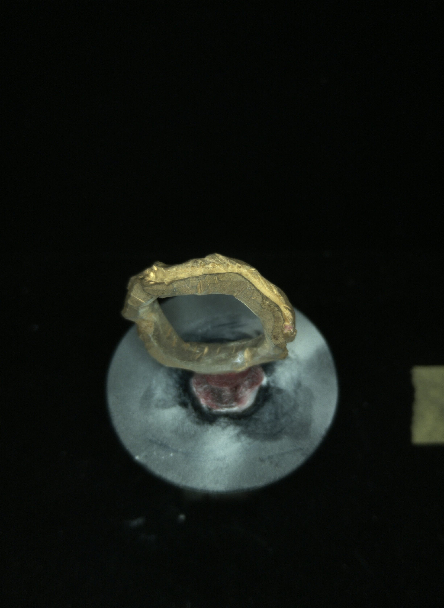
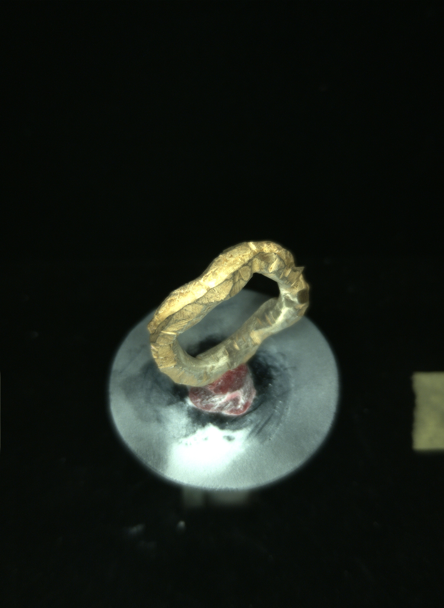

# Focus Stacking for Microscopy and Macro Photography

This focus stacking tool was developed specifically for the [OpenScan](https://openscan.eu) community to enable high-quality focus stacking for photogrammetry and 3D scanning applications. OpenScan is an open-source 3D scanner project that makes professional 3D scanning accessible to everyone.

## Results

Here are some example results from the focus stacking process:




These images demonstrate the tool's capability to combine multiple images taken at different focus distances into a single, sharp composite image where the entire subject is in focus.

## Quick Start Guide

### Using the GUI

1. Launch the application:
```bash
python src/main.py
```

2. Using the tool:
   - Click "Select Images" to choose your focus stack images
   - Images should be taken at different focus distances of the same subject
   - Name your images with sequential numbers (e.g., scan_1.jpg, scan_2.jpg, etc.) For best results check the output filenames of your Openscanner, should be ok.
   - All images in a stack should be taken with the same camera settings
   - Recommended: 5-15 images per stack with small focus steps

3. Processing:
   - Select your output folder
   - Click "Process Stack" to start focus stacking
   - The tool will automatically align and blend your images
   - Results will be saved in your chosen output folder

### Tips for Best Results

1. Image Capture:
   - Use a stable setup (tripod or scanning rig)
   - Keep consistent lighting
   - Use manual focus and consistent camera settings
   - Take more images than you think you need (small focus steps)
   - Ensure good overlap between focus areas

2. For Photogrammetry:
   - Ensure the main subject is perfectly sharp
   - Background blur is acceptable and normal
   - Use enough images to capture all depth levels of your subject

Advanced focus stacking implementation optimized for microscopy and macro photography, with GPU acceleration using CUDA. This tool is specifically designed for handling the unique challenges of microscopy and macro photography, including high magnification, shallow depth of field, and the need for precise alignment.

Perfect for:
- Photogrammetry and 3D scanning
- Microscopy imaging (biological, metallurgical, etc.)
- Macro photography (insects, minerals, small objects)
- Product photography requiring full depth of field
- Scientific documentation and research

[](https://buymeacoffee.com/sha5b)

## System Requirements & Testing Environment

This software has been developed and tested on:
- Windows 11
- NVIDIA RTX 3080 Ti with CUDA 12.x
- Python 3.8 or higher

Requirements:
- NVIDIA GPU with CUDA support (minimum 4GB VRAM recommended)
- CUDA Toolkit 11.0 or higher
- Visual Studio Build Tools (Windows) or GCC (Linux)

For Windows users:
1. Install Visual Studio Build Tools 2019 or later with C++ development tools
2. Install CUDA Toolkit from NVIDIA's website
3. Ensure your GPU drivers are up to date

For Linux users:
1. Install GCC and required development tools:
   ```bash
   # Ubuntu/Debian
   sudo apt-get update
   sudo apt-get install build-essential

   # Fedora
   sudo dnf groupinstall "Development Tools"
   ```
2. Install CUDA Toolkit from NVIDIA's website or package manager

## Setup

1. Create and activate a virtual environment:
```bash
# Windows
python -m venv venv
venv\Scripts\activate

# Linux/Mac
python3 -m venv venv
source venv/bin/activate
```

2. Install requirements:
```bash
pip install -r requirements.txt
```

## Advanced Usage (Python API)

For advanced users who want to integrate the focus stacking into their own scripts:

```python
from focus_stacker import FocusStacker

# Initialize stacker with default settings
stacker = FocusStacker()

# Process a single stack
result = stacker.process_stack(['image1.jpg', 'image2.jpg', 'image3.jpg'])
stacker.save_image(result, 'output.jpg')

# Process multiple stacks in a directory
import glob
image_paths = glob.glob('path/to/images/*.jpg')
stacks = stacker.split_into_stacks(image_paths, stack_size=3)

for i, stack in enumerate(stacks):
    result = stacker.process_stack(stack)
    stacker.save_image(result, f'output_{i+1}.jpg')
```

### Options

The `FocusStacker` class accepts several parameters to fine-tune the stacking process:

- `radius` (1-20, default: 8): Size of the focus measure window. Larger values can help with noisy images but may reduce detail.
- `smoothing` (1-10, default: 4): Amount of smoothing applied to focus maps. Higher values reduce noise but may affect edge detection.
- `scale_factor` (1-4, default: 2): Processing scale multiplier:
  - 1 = original resolution
  - 2 = 2x upscaling (recommended)
  - 3 = 3x upscaling (more detail, slower)
  - 4 = 4x upscaling (maximum detail, much slower)

Example with custom options:
```python
stacker = FocusStacker(
    radius=10,      # Larger focus window
    smoothing=3,    # Less smoothing for more detail
    scale_factor=3  # 3x upscaling for enhanced detail
)
```

### Memory Management Tips

1. For large images (>30MP):
   - Start with scale_factor=1
   - Process one stack at a time
   - Close other GPU-intensive applications

2. If you get CUDA out of memory errors:
   - Reduce scale_factor
   - Process smaller batches
   - Free up GPU memory from other applications

## Performance and Results

### Processing Times
Typical processing times on an RTX 3060 (12GB):
- 12MP images: ~5-10 seconds per stack
- 24MP images: ~15-20 seconds per stack
- 45MP images: ~30-40 seconds per stack
- >50MP images: May require scale_factor=1 due to memory constraints

Memory usage scales with image resolution and scale_factor. As a rough guide:
- 12MP images: ~4GB VRAM
- 24MP images: ~6GB VRAM
- 45MP images: ~10GB VRAM
- >50MP images: >12GB VRAM

### Quality Expectations
- Best results with 5-15 images per stack
- Excellent detail preservation in microscopy samples
- Clean edges with minimal artifacts
- Natural-looking transitions between focus regions

## Known Issues

1. High memory usage with large images (>50MP)
2. May require manual alignment for extreme focus differences
3. Limited to NVIDIA GPUs (CUDA requirement)
4. Some color shifts in high-contrast areas
5. Occasional alignment issues with highly repetitive patterns
6. Memory errors possible with large images at high scale factors

## Contributing

Contributions are very welcome! Whether you're fixing bugs, adding new features, or improving documentation, your help is appreciated.

Feel free to:
- Fork the repository
- Create a feature branch
- Submit pull requests
- Open issues for bugs or feature requests
- Suggest improvements

Let's make this tool even better together!

## License

This project is licensed under a Non-Commercial Open Source License (NCOSL). This means:
- ✅ Free for personal and academic use
- ✅ Open source and can be modified
- ✅ Must maintain the same license if distributed
- ❌ Cannot be used for commercial purposes without permission
- ❌ Cannot be sold or included in commercial products

See the LICENSE file for full details.

For commercial licensing inquiries, please open an issue or contact the project maintainer.
